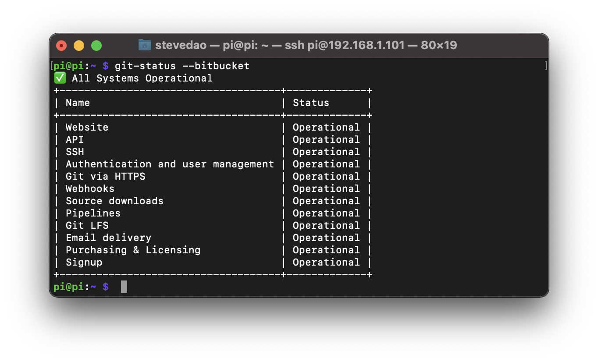

# git-status
[](https://img.shields.io/badge/Swift-5.1_5.2_5.3_5.4-Orange?style=flat-square)
[](https://img.shields.io/badge/Platforms-macOS_iOS_tvOS_watchOS_Linux_Windows-Green?style=flat-square)
[](https://img.shields.io/badge/Swift_Package_Manager-compatible-orange?style=flat-square)
[](https://github.com/yonaskolb/Mint)


Simple CLI written by Swift to check the health status of Git providers such as Github, GitLab, Bitbucket. Supporting macOS & Linux, not yet tested on Windows but it should work as well. This repo is still being developed, feel free to contribute 💖

## Installation
[Mint](https://github.com/yonaskolb/mint) is designed to be used with Swift command line tools that build with the Swift Package Manager. It makes installing, running and distributing these tools much easier.

```
$ mint install SwiftCLI/git-status
```

## Usage
```
$ git-status --bitbucket
```



Please go to the help menu for more informations:

```
$ git-status --help
```

## Checklist
These are some pending tasks should be developed, your contributions are appriciated!
- [ ] Support more providers: Github, Gitlab.
- [ ] Add an option to check & notify to Chat apps: Slack, Google Chat, ...
- [ ] Relace [Data(contentsOf:)](https://developer.apple.com/documentation/foundation/nsdata/1413892-init) method by using a cross-platform network manager client instead.
- [ ] Implement uint test cases.

## Tech stacks
I'm a fan of Reactive Programming, currently working on [RxSwift](https://github.com/ReactiveX/RxSwift) & [Combine](https://developer.apple.com/documentation/combine). Even though RxSwift is already cross-platform but Combine. I give a try to use an open-source version of Apple Combine: [OpenCombine](https://github.com/OpenCombine/OpenCombine).

## Limitations
Currently, [Swift Core Libraries](https://swift.org/core-libraries/) not yet fully support for Linux, therefore we can't use [URLSession](https://developer.apple.com/documentation/foundation/urlsession) to make network requests. I'm working around by using [Data(contentsOf:)](https://developer.apple.com/documentation/foundation/nsdata/1413892-init) method instead. It looks urgly but no choice!

## License
SwiftCLI/git-status is released under the MIT license.
